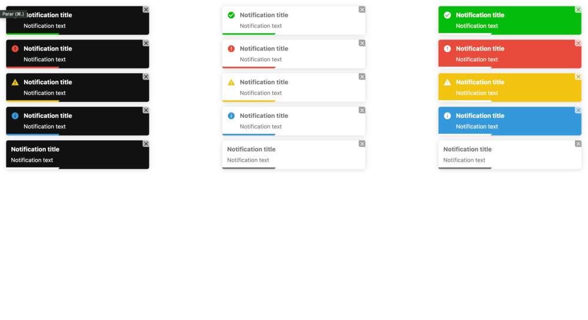

# React Hook Notification

Add notifications in your React app. Types: success, error, warning, info or default



## Storybook demo

[https://reverent-lalande-5e2160.netlify.app](https://reverent-lalande-5e2160.netlify.app/?path=/story/notification-example--notificaion)

## Install

```shell
npm install react-hook-notification
```

or

```shell
yarn add react-hook-notification
```

## Usage

```js
import React from 'react';
import { useNotification } from 'react-hook-notification';

export default function Component() {
  const notification = useNotification();

  return (
    <button
      type="button"
      onClick={() =>
        notification.success({
          text: 'Notification test',
        })
      }
    >
      Dispatch
    </button>
  );
}
```

### Props

| Property        | Type                                                                                | Required | Default   | Description                                                |
| --------------- | ----------------------------------------------------------------------------------- | -------- | --------- | ---------------------------------------------------------- |
| text            | string                                                                              | yes      |           | Notification text                                          |
| title           | string                                                                              | no       |           | Notification title                                         |
| position        | top-right \| top-center \| top-left \| bottom-right \| bottom-center \| bottom-left | no       | top-right | Notification position                                      |
| theme           | colored \| light \| dark                                                            | no       | colored   | Notification theme                                         |
| transition      | bounce \| flip \| fade \| slide \| zoom                                             | no       | bounce    | Notification transition                                    |
| delay           | number                                                                              | no       | 5000      | Notification delay in milliseconds                         |
| showProgressBar | boolean                                                                             | no       | true      | Notification shows or hides progress bar                   |
| showButtonClose | boolean                                                                             | no       | true      | Notification show or hide close button                     |
| closeOnClick    | boolean                                                                             | no       | true      | Notification closes on click                               |
| showIcon        | boolean                                                                             | no       | true      | Notification show or hide icon                             |
| autoClose       | boolean                                                                             | no       | true      | Automatic closing of the notification after the delay ends |
| pauseOnHover    | boolean                                                                             | no       | true      | Auto close pause on hover                                  |
| draggable       | boolean                                                                             | no       | true      | Enable or disable drag                                     |

## LICENSE

[](https://opensource.org/licenses/MIT)

Developed by: [André Coelho](https://andrecoelho.dev)
